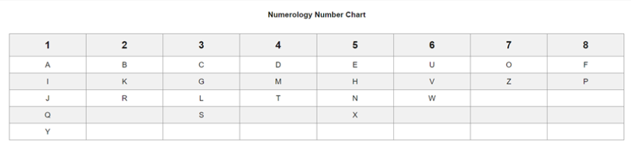

# Numerology Calculator

## Coding Challenge Description
The goal of this coding challenge is to create a numerology calculator that computes three key numerology numbers based on a user's name. The calculations include:
- **Destiny Number**: Represents the individual's purpose and life path, calculated as the sum of all letter values in the name.
- **Heart's Desire Number**: Reflects the person's inner self and desires, calculated as the sum of vowel values.
- **Personality Number**: Indicates how others perceive the individual, calculated as the sum of consonant values.

The program should validate user input to ensure it only contains alphabetic characters and spaces.

Below is the numerology chart for the challenge:


## How to Run
To run the Numerology Calculator, follow these steps:
1. Ensure you have Dart installed on your system. You can download it from the [Dart SDK](https://dart.dev/get-dart) page.
2. Open a terminal and navigate to the directory where the file is saved
   ```
   cd bin
   ```
3. Run the following command to execute the program:
   ```
   dart run coding_challenge.dart
   ```
4. Follow the prompts in the terminal to enter your full name.

## Challenges
During the development of this program, I encountered several challenges:
- **Input Validation**: Ensuring that the user input was valid and contained only alphabetic characters and spaces was challenging. I solved this by implementing a regular expression check and throwing a custom exception for invalid inputs.
- **Numerology Calculations**: Reducing numbers to a single digit while handling master numbers (11 and 22) required careful implementation. I resolved this by creating a dedicated method to handle the reduction logic clearly and concisely.

## Highlights
- **Modular Design**: I am proud of the modular structure of the code. The separation of concerns between input handling, calculations, and the result representation improves readability and maintainability.
- **Custom Exception Handling**: Creating a custom exception class for invalid inputs improves the program's reliability by offering clearer feedback to users.

## Defects
While the program functions as intended, there are some limitations and potential defects:
- **Non-alphabetic Characters**: The program will throw an exception if the user inputs any non-alphabetic characters, but it may not handle cases with numbers or special characters gracefully.
- **Master Number Handling**: Although master numbers (11 and 22) are recognized and returned without reduction, any additional master numbers that may be added in numerology (like 33) are currently not supported.

## Limitations
- The program currently only supports names with alphabetic characters and spaces. Any other character types will result in an exception.
- There is no functionality to handle multi-part names or names with additional formatting (like hyphens or apostrophes).
- The numerology calculations are based solely on the provided chart and may not account for different numerology traditions.
